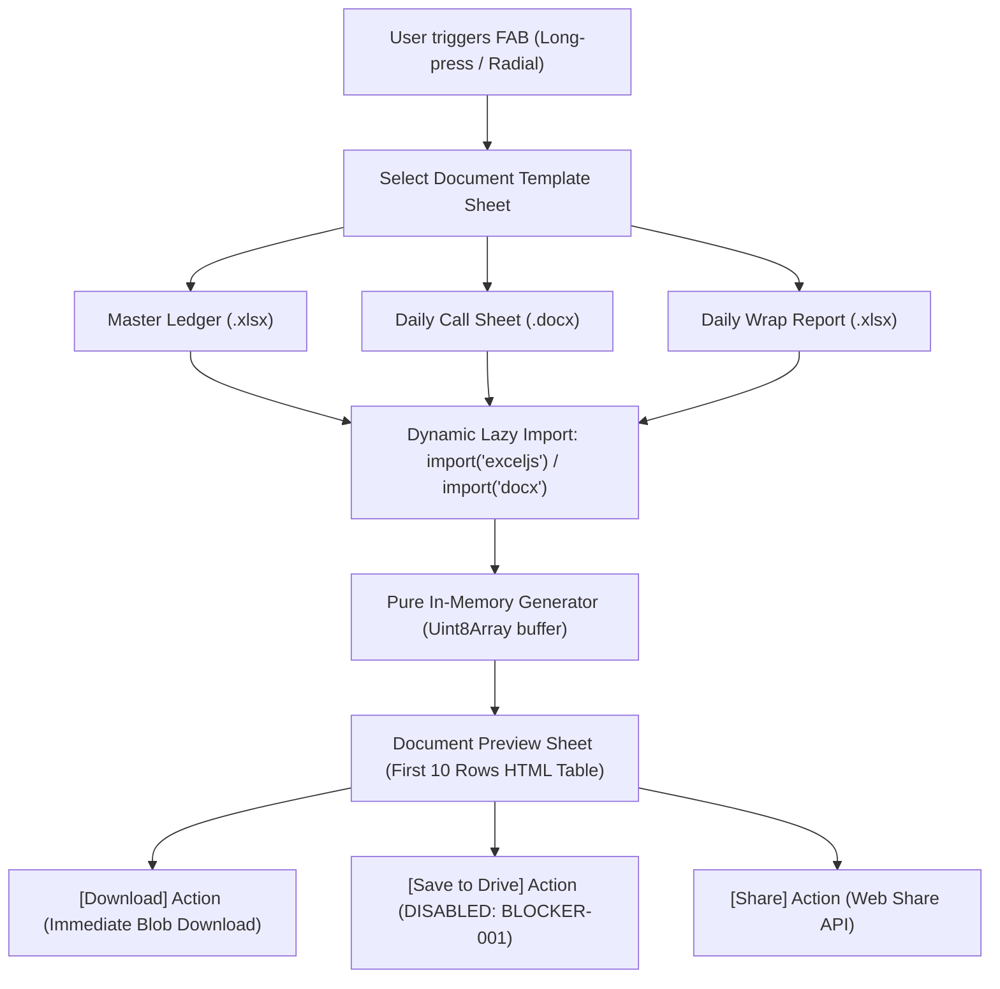

# Document Generation Feature Specification

**Version**: 1.0.0 (G.6 Unblocked Parts)  
**Status**: Live / Production Ready  
**Related ADR**: [ADR-010: Document Generation Strategy](../adr/ADR-010-document-generation-strategy.md)  
**Modules**: `lib/documents/`, `components/mobile/DocumentPreviewSheet.tsx`, `components/mobile/FAB.tsx`

---

## 1. Overview & Architecture

ClosedBook provides client-side document generation for film and commercial productions. All compilation executes in memory within the client browser, maintaining strict adherence to ClosedBook's **Zero-Server-Retention** guarantee: no financial data, scene breakdown, or crew roster is ever transmitted to a backend document processing service.

### Generation & Distribution Flow

---

## 2. Library Selection & Justification

| Library | Target Output | Key Capabilities | Bundle Strategy |
| :--- | :--- | :--- | :--- |
| **`exceljs`** | `.xlsx` (Master Ledger, Wrap Report) | Header freeze panes (`ySplit: 1`), `=SUM(...)` formulas, cell colors, borders, currency formatting | Lazy-loaded via dynamic import; 0 KB initial bundle cost |
| **`docx`** | `.docx` (Daily Call Sheet) | Professional tables, paragraph hierarchies, call time highlights, emergency advisories | Lazy-loaded via dynamic import; 0 KB initial bundle cost |

### Why not SheetJS (Community Edition)?
SheetJS Community Edition restricts cell styling, background fills, and borders to its commercial/Pro tier. Furthermore, historical security advisories (e.g., CVE-2023-30533) make `exceljs` the safer choice for client-side compilation with zero licensing barriers.

### Why not Manual OpenXML via JSZip?
While manual XML string concatenation is used for rudimentary template seeding (`lib/workspace/template-seeder.ts`), maintaining production-grade `.docx` tables and `.xlsx` formula chains manually introduces severe fragility and XML validation risks.

---

## 3. Template Schemas & Specifications

### 3.1. Master Production Ledger (`.xlsx`)
- **Generator**: `lib/documents/generators/ledger-generator.ts`
- **MimeType**: `application/vnd.openxmlformats-officedocument.spreadsheetml.sheet`
- **Columns**: Date (A), Description (B), Category (C), Payment Method (D), Amount (E), Notes (F)
- **Features**:
  - Row 1 frozen (`worksheet.views = [{ state: 'frozen', ySplit: 1 }]`)
  - Dark charcoal header (`#1C1917`) with bold white text
  - Currency formatting: `"$#,##0.00;[Red]("$"#,##0.00);"-"`
  - Grand total row with dynamic Excel formula `=SUM(E2:E...)` and double accounting underline

### 3.2. Daily Call Sheet (`.docx`)
- **Generator**: `lib/documents/generators/call-sheet-generator.ts`
- **MimeType**: `application/vnd.openxmlformats-officedocument.wordprocessingml.document`
- **Sections**:
  - Production Title Header & Day X of Y indicator
  - General Crew Call banner (high contrast crimson accent)
  - Nearest Hospital emergency safety info & weather forecast
  - Shooting Schedule table (Scene #, Day/Night, Pages, Description, Cast IDs, Location)
  - Cast Call Times table (Character, Actor, Individual Call Time, Notes)

### 3.3. Daily Wrap Report (`.xlsx`)
- **Generator**: `lib/documents/generators/wrap-report-generator.ts`
- **MimeType**: `application/vnd.openxmlformats-officedocument.spreadsheetml.sheet`
- **Columns**: Department (A), Approved Budget (B), Actual Today (C), Actual To Date (D), Variance (E)
- **Features**:
  - Row 1 frozen
  - Dynamic Excel formula for department variance: `=B{row}-D{row}`
  - Summary total row with `=SUM(B2:B...)`, `=SUM(C2:C...)`, `=SUM(D2:D...)`, and net variance calculation

---

## 4. Mobile User Experience & Interaction

1. **FAB Radial Menu**: Long-press on the floating action button reveals the radial menu with "Generate Document".
2. **Template Selector**: Slides up as a BottomSheet with 3 production options, clear format badges (`.XLSX`, `.DOCX`), and descriptions.
3. **Document Preview Sheet**:
   - Parses the binary `Uint8Array` in-memory.
   - Renders the first 10 rows in an accessible HTML table.
   - Shows file metadata (template name, filename, formatted size, timestamp).
   - Primary Action: `[Download]` triggers immediate client-side Blob download.
   - Secondary Action: `[Share]` triggers Web Share API on mobile devices.

---

## 5. BLOCKER-001 Dependency Note

The `[Save to Drive]` action inside `DocumentPreviewSheet` is currently:
- `disabled={true}`
- Marked with `aria-disabled="true"`
- Accompanied by tooltip and inline notice: *"Login Google required (blocked by BLOCKER-001)"*

Once Google OAuth production credentials (BLOCKER-001) are approved and unblocked in G.6, the `Save to Drive` action will directly invoke the Google Drive v3 multipart upload flow without requiring any user re-architecture. Integration MSW mock handlers are pre-configured in `tests/integration/msw-handlers.ts`.
