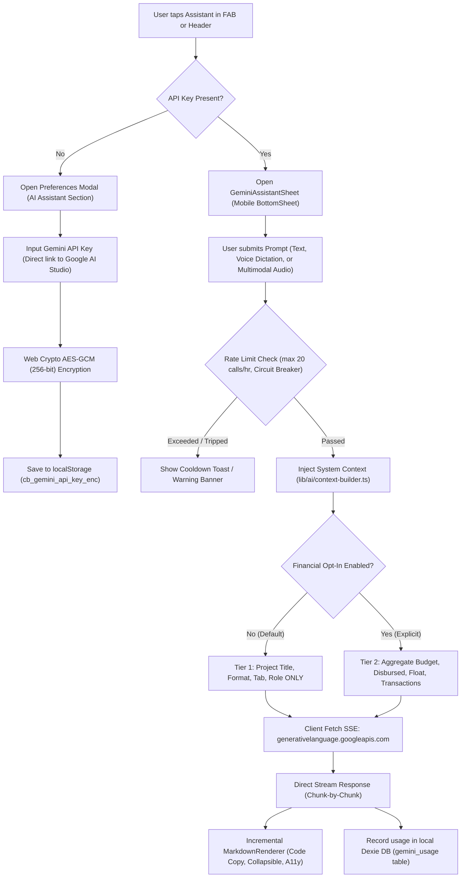

# Gemini AI Mobile Assistant Feature Specification

**Version**: 1.0.0 (Sub-Fase G.7)  
**Status**: Live / Production Ready  
**Related ADR**: [ADR-011: Gemini BYOK Architecture](../adr/ADR-011-gemini-byok-architecture.md)  
**Modules**: `lib/ai/`, `components/mobile/GeminiAssistantSheet.tsx`, `components/mobile/VoiceInput.tsx`, `components/mobile/VoiceRecording.tsx`, `components/mobile/MarkdownRenderer.tsx`

---

## 1. Overview & BYOK Architecture

ClosedBook integrates Google's **Gemini 2.0 Flash** model directly on the client side via a **Bring Your Own Key (BYOK)** model. This design eliminates third-party backend proxies, reduces operational server costs to zero, and strictly adheres to ClosedBook's **Zero-Server-Retention** guarantee: production accountants and film crew members can leverage cutting-edge AI assistance without exposing confidential budget ledgers, actor contracts, or shoot locations to ClosedBook servers.

### Architectural Flowchart

---

## 2. Security & Hardware-Derived Key Storage

| Mechanism | Implementation Detail | Guarantee |
| :--- | :--- | :--- |
| **AES-GCM (256-bit)** | Web Crypto API (`window.crypto.subtle`) encrypts the raw API key with a 12-byte initialization vector (IV). | Industry-standard authenticated symmetric encryption. |
| **Hardware Key Derivation** | Primary derivation through WebAuthn PRF / Device Salt (`cb_gemini_salt`); PBKDF2 with 100,000 SHA-256 iterations. | Device-bound encryption prevented from cross-device scraping. |
| **SessionStorage Fallback** | If `window.crypto` is unavailable in restricted web contexts, raw keys are stored ephemerally in `sessionStorage` with a 30-minute expiration TTL. | Keys are wiped when the browser tab or session terminates. |
| **Zero Key Exposure** | The decrypted API key exists only in component execution memory during the active request lifecycle and is never written to DOM attributes, logs, or network headers to ClosedBook. | Complete protection against server-side leakage or breach. |

---

## 3. Data Privacy: Data Sent vs. Data Never Sent

ClosedBook enforces strict privacy partitioning for all AI operations:

### Data Sent to Google Gemini API
- User's typed or spoken prompt.
- Tier 1 Context (always included): Active Project Name, Production Format (Feature/Commercial/Series), Current Workspace View, User Role.
- Tier 2 Context (strictly opt-in via Preferences, default OFF): Total Budget, Total Actual Spend, Remaining Float, Recent Transaction Summary.
- Audio payloads (Multimodal recording only, when user taps Send Voice Note).

### Data NEVER Sent to Any Server or Model
- Raw bank account numbers, routing numbers, or payment credentials.
- Full unredacted payroll rosters, tax IDs (SSN / TIN), or union scale contract docs.
- ClosedBook telemetry, cookies, or user profile authentication tokens.
- No data is EVER sent to a ClosedBook backend server (all network traffic flows purely between the browser and `generativelanguage.googleapis.com`).

---

## 4. Input Modalities

### 4.1. Fast Voice Dictation (Tier 1)
- **Engine**: Web Speech API (`webkitSpeechRecognition` / `SpeechRecognition`).
- **Target Use Case**: Hands-free quick notes and queries on set (<10 seconds).
- **Features**: Visual waveform bar animation, 10s auto-stop countdown, instant transcript appending to text area.
- **Graceful Fallback**: On unsupported platforms (notably iOS Safari), displays a non-intrusive warning recommending Chrome or Android for live dictation.

### 4.2. Multimodal Audio Notes (Tier 2)
- **Engine**: `MediaRecorder` API recording WebM / MP4 audio.
- **Target Use Case**: Complex wrap notes, spoken logistics updates, or audio memos (<60 seconds, capped at 10 MB).
- **Format**: Sent directly to Gemini 2.0 Flash using inline base64 audio parts (`mime_type: audio/webm;codecs=opus` or `audio/mp4`).
- **Features**: Live duration timer, pulsing microphone beacon, audio preview before sending, discard button.

---

## 5. Rate Limiting & Circuit Breaker Architecture

To prevent runaway billing and API quota exhaustion on Google AI Studio's free tier:

1. **Hourly Rate Limit**:
   - Limit: **20 calls / hour** per device.
   - Warning Toast: Triggered proactively at **16 calls / hour** (80% quota).
   - Storage: Tracked locally in IndexedDB (`ClosedBookDB.gemini_usage`).

2. **Circuit Breaker**:
   - Trigger: **5 consecutive API failures** (e.g. 500 server errors, repeated network disconnects).
   - Cooldown: AI requests are automatically suspended for **5 minutes** to prevent spamming Google APIs and draining device battery.
   - Feedback: Clear countdown timer presented in the UI with a manual "Reset" button for power users.

3. **Monthly Usage Tracking**:
   - Total queries and approximate tokens are aggregated monthly in local storage.
   - Summarized cleanly in the "AI Assistant" card inside Preferences Modal.

---

## 6. Error Taxonomy & Resilience

The assistant implements comprehensive error mapping in `lib/ai/gemini-client.ts`:

| Status Code / Error | User Notification | Suggested Action |
| :--- | :--- | :--- |
| **401 / 403 (Invalid Key)** | "API key Gemini Anda tidak valid atau telah kedaluwarsa." | Prompts user to re-enter their key in Settings. |
| **429 (Rate Limit)** | "Batas penggunaan API tercapai (Rate Limit 429)." | Informs user to pause for a few minutes or upgrade their quota. |
| **500 / 503 (Upstream Error)**| "Layanan Gemini sedang mengalami gangguan sementara." | Trippable into Circuit Breaker if consecutive. |
| **Safety Block** | "Respons diblokir oleh kebijakan keamanan konten Gemini." | Explains safety block without throwing uncaught exceptions. |
| **30s Abort Timeout** | "Permintaan ke Gemini memakan waktu terlalu lama (>30 detik)." | Aborts fetch via `AbortController` to preserve battery and UI responsiveness. |
| **Offline / Network Drop** | "Koneksi terputus. ClosedBook membutuhkan internet untuk asisten AI." | Reassures that all core accounting functions remain 100% offline-functional. |

---

## 7. UX & Accessibility Standards

- **Mobile First**: Presented as an intuitive BottomSheet accessible directly from mobile FAB and header shortcuts.
- **Zero Input Zoom**: Text input explicitly set to `16px font-size` on mobile devices to prevent automatic iOS Safari viewport zoom.
- **Zero Layout Shift**: Fixed response container with smooth markdown streaming.
- **A11y Compliance**: Fully keyboard navigatable, screen-reader labeled (`aria-live="polite"` for stream outputs), and passed 100% axe-core checks with zero violations across Chrome, Safari, and Firefox.
